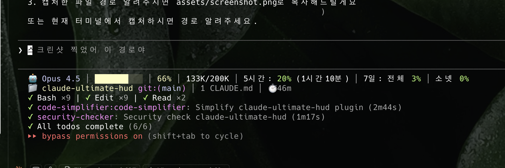

# claude-ultimate-hud

[English](README.en.md) | [한국어](README.md)

Ultimate status line plugin for Claude Code - combines the best of [claude-dashboard](https://github.com/uppinote20/claude-dashboard) and [claude-hud](https://github.com/jarrodwatts/claude-hud).



## Features

### From claude-dashboard
- 🤖 **Model Display**: Current model (Opus, Sonnet, Haiku)
- 📊 **Progress Bar**: Color-coded context usage (green → yellow → red)
- 📈 **Token Count**: Current/total tokens (K/M format)
- ⏱️ **Rate Limits**: 5h/7d limits with reset countdown

### From claude-hud
- 📁 **Project Info**: Directory name with git branch
- 📋 **Config Counts**: CLAUDE.md, rules, MCPs, hooks
- ⏱️ **Session Duration**: How long you've been working
- 🔧 **Tool Activity**: Running/completed tools with counts
- 🤖 **Agent Status**: Subagent progress tracking
- ✅ **Todo Progress**: Current task and completion rate

### v1.4.0 - Code Cleanup & Quality
- 🗑️ **Remove OMC Code**: Removed ralph/autopilot/ultrawork tracking, deleted `omc-state.ts` (bundle 39.8KB → 36.9KB, -7.3%)
- 🛡️ **Stdin Validation**: Clear `⚠️ stdin: missing fields` error on missing required fields
- 🔢 **Token Format Precision**: Values ≥950K now show in M notation (`999K` → `1.0M`)
- 🎯 **Constants Consolidation**: Color thresholds 50/80 → `COLOR_THRESHOLD_WARNING/DANGER`
- 🧹 **Remove AUTOCOMPACT_BUFFER**: Removed no-op constant (value was 0)
- 🔍 **Debug Trace Logging**: `debugTrace()` for cache hit/miss, credential source tracking
- 🔒 **Strict Perms Mode**: `CLAUDE_HUD_STRICT_PERMS=1` rejects insecure file permissions
- 📦 **API Beta Header Constant**: Extracted to `ANTHROPIC_BETA_HEADER`

### v1.3.1 - 60x Performance Improvement
- 🔥 **clearTimeout Bug Fix**: `readStdin()` setTimeout handle was never cleared after success, blocking process exit for 2-5 seconds
- ⚡ **Config-counter File Cache** (60s TTL): Eliminates 15+ sync FS calls per invocation
- ⚡ **Git Branch File Cache** (30s TTL): Eliminates child process spawn per invocation
- 🔀 **Parallelize getTranslations**: Moved from sequential to Phase 2 parallel I/O block
- 📉 **Reduce STDIN Timeout**: 5s → 2s

### New in v1.3.0
- ⚡ **Incremental Transcript Parsing**: File-cache based incremental reading for consistent HUD speed regardless of session length
- 🚀 **5x API Cache TTL**: 60s → 300s, significantly reducing API blocking frequency
- 🏗️ **Pre-built JS**: statusLine runs `dist/index.js` directly, skipping TS compilation
- 🌐 **i18n Expansion**: Todo completion and Thinking state messages now translated (EN/KO)
- 🐛 **Variable Shadowing Fix**: Fix `t` variable collision in `omc-line.ts`

### Additional
- 🌐 **i18n**: English and Korean support (auto-detect)

## Output Example

```
🤖 Opus 4.6 │ ████░░░░░░ 18% │ 37K/200K │ 5h: 12% (3h59m) │ 7d: all 18% │ Sonnet 1%
💭 thinking │ 🎯 skill:commit │ T:42 A:5 S:2
📁 my-project git:(main) │ 2 CLAUDE.md │ 8 rules │ 6 MCPs │ 6 hooks │ ⏱️ 1h30m
◐ Read: file.ts │ ✓ Bash ×5 │ ✓ Edit ×3
◐ explore: Finding patterns... │ ✓ librarian (2s)
▸ Implement auth flow (2/5)
⚠️ Context 85% - consider /compact
```

## Installation

### From Plugin Marketplace

```
/plugin marketplace add hadamyeedady12-dev/claude-ultimate-hud
/plugin install claude-ultimate-hud
/claude-ultimate-hud:setup
```

> **Note**: Marketplace installs to `~/.claude/plugins/cache/claude-ultimate-hud/`

### Manual Installation

```bash
git clone https://github.com/hadamyeedady12-dev/claude-ultimate-hud.git ~/.claude/plugins/claude-ultimate-hud
cd ~/.claude/plugins/claude-ultimate-hud
bun install && bun run build
```

Then run:
```
/claude-ultimate-hud:setup
```

## Configuration

```
/claude-ultimate-hud:setup
```

Running the command will show an interactive menu to select your plan:

| Plan | Description |
|------|-------------|
| `max200` | Max $200/month (20x) - 5h + 7d all + 7d Sonnet **(Recommended)** |
| `max100` | Max $100/month (5x) - 5h + 7d all + 7d Sonnet |
| `pro` | Pro - 5h only |

Setup will ask for both **language** and **plan** preferences. To change later, edit `~/.claude/claude-ultimate-hud.local.json` and set `language` to `en`, `ko`, or `auto`.

## Requirements

- **Claude Code** v1.0.80+
- **Bun** or **Node.js** 18+

## Color Legend

| Color | Usage % | Meaning |
|-------|---------|---------|
| 🟢 Green | 0-50% | Safe |
| 🟡 Yellow | 51-80% | Warning |
| 🔴 Red | 81-100% | Critical |

## Plan Differences

| Feature | pro | max100 | max200 |
|---------|-----|--------|--------|
| 5h rate limit | ✅ | ✅ | ✅ |
| Reset countdown | ✅ | ✅ | ✅ |
| 7d all models | ❌ | ✅ | ✅ |
| 7d Sonnet only | ❌ | ✅ | ✅ |

### Rate Limits Detail

| Plan | 5-hour | Weekly Sonnet | Weekly Opus |
|------|--------|---------------|-------------|
| Max $100 (5x) | ~225 messages | 140-280 hours | 15-35 hours |
| Max $200 (20x) | ~900 messages | 240-480 hours | 24-40 hours |

## Credits

This plugin combines features from:
- [claude-dashboard](https://github.com/uppinote20/claude-dashboard) by uppinote
- [claude-hud](https://github.com/jarrodwatts/claude-hud) by Jarrod Watts

Special thanks to **별아해 (byeorahae)** for valuable feedback and bug fixes.

Built with [OhMyOpenCode](https://github.com/anthropics/claude-code).

## Changelog

### v1.4.0
- 🗑️ **Remove OMC Code** (bundle 39.8KB → 36.9KB, -7.3%)
  - Deleted `omc-state.ts`, removed ralph/autopilot/ultrawork tracking
  - Thinking/skill/count preserved in `renderStatsLine`
- 🛡️ **Stdin Validation**: Clear error on missing required fields (`model`, `context_window`, `cost`)
- 🔢 **Token Format Fix**: ≥950K uses M notation (`999K` → `1.0M`)
- 🎯 **Constants**: Color thresholds → `COLOR_THRESHOLD_WARNING/DANGER`
- 🧹 **Remove AUTOCOMPACT_BUFFER**: No-op constant (value 0) removed
- 🔍 **Debug Trace**: `debugTrace()` for cache hit/miss, credential source
- 🔒 **Strict Perms**: `CLAUDE_HUD_STRICT_PERMS=1` rejects insecure credential files
- 📦 **API Beta Header**: Extracted to `ANTHROPIC_BETA_HEADER` constant

### v1.3.1
- 🔥 **60x Performance Improvement** (2.0s → 0.033s)
  - `readStdin()` setTimeout handle was never cleared after successful read, keeping the bun process alive until timer expiry
  - Added `clearTimeout` on both success and error paths
- ⚡ **Config-counter File Cache** (60s TTL)
  - Eliminates 15+ synchronous filesystem calls, returns cached result on hit
- ⚡ **Git Branch File Cache** (30s TTL)
  - Eliminates child process spawn (`git rev-parse`), returns cached result on hit
- 🔀 **Parallelize getTranslations**
  - Moved from sequential Phase 1 → Phase 2 parallel I/O block
- 📉 **Reduce STDIN Timeout**: 5s → 2s

### v1.3.0
- ⚡ **Incremental Transcript Parsing**
  - File-cache based: remembers last parse position and only reads new content
  - Returns instantly from cache when file size is unchanged (O(1))
  - Consistent HUD refresh speed regardless of session length
- 🚀 **5x API Cache TTL Increase**
  - Default cache TTL: 60s → 300s
  - Significantly reduces blocking from rate limit API calls
- 🏗️ **statusLine Optimization**
  - Runs pre-built `dist/index.js` directly instead of compiling `src/index.ts`
- 🌐 **i18n Expansion**
  - Todo completion message translation (`All todos complete` / `모든 할 일 완료`)
  - Thinking state translation (`thinking` / `사고 중`)
  - Added Translations parameter to `renderTodosLine` and `renderOmcLine`
- 🐛 **Variable Shadowing Fix**
  - Resolved `t: Translations` parameter collision with `const t = ctx.transcript` in `omc-line.ts`

### v1.2.0
- 📊 **Context Accuracy**
  - Fix `AUTOCOMPACT_BUFFER` from 45000 → 0 for accurate token usage display
- ⚠️ **Context Warning Banner**
  - 80-89%: Yellow `⚠️ Context 85% - consider /compact`
  - 90%+: Red `🔴 Context 95% - /compact recommended!`
  - EN/KO i18n support
- 🔄 **OMC Mode Status Display**
  - ralph (`🔄 ralph:3/10`), autopilot (`🤖 autopilot:Plan(2/5)`), ultrawork (`⚡ ultrawork`)
  - 3-level fallback: session → state dir → .omc root
  - Auto-ignores stale files (>2 hours)
  - Complete no-op without OMC (zero extra output)
- 💭 **Thinking Indicator**: Shows `💭 thinking` during model reasoning
- 🎯 **Skill Tracking**: Displays last invoked skill name
- 📈 **Call Counters**: `T:42 A:5 S:2` (cumulative tool/agent/skill counts)

### v1.1.6
- 🐛 **MCP Server Count Fix**
  - Detect project-scoped MCP servers from `.claude.json` (`projects[cwd].mcpServers`)
  - Detect Chrome extension MCP (`claude-in-chrome`) via config flags
  - Set-based deduplication for accurate server counts
- ⚙️ **Setup Improvements**
  - Add language selection: English / Korean / Auto

### v1.1.5
- 🔒 **Security**
  - Fix path traversal vulnerability (`resolve()` + `sep` prefix check)
  - Add 3s timeout to keychain/exec commands (prevent infinite blocking)
  - Validate credential file permissions (warn if world-readable)
- 🐛 **Bug Fixes**
  - Fix Korean `shortHours`: `'시간'` → `'시'` (layout consistency)
  - Add runtime type guard for transcript parser (remove unsafe cast)
  - Track parse errors with 50% threshold warning
- ⚡ **Performance**
  - Convert sync `execFileSync` → async `execFile` + `Promise.all` parallelization
  - Add 5s stdin read timeout
  - Atomic cache file writes (temp file + rename)
- 🛠️ **Code Quality**
  - Add debug mode: `CLAUDE_HUD_DEBUG=1` for detailed error output
  - Diagnostic error messages (`⚠️ stdin`, `🔑 ?` to distinguish causes)
  - Consolidate 13 magic numbers into `constants.ts` with JSDoc
  - Optimize screenshot: 776KB → 241KB (-69%)

### v1.1.4
- 🐛 **Bug Fix**: Fix language auto-detection on macOS when `LANG=C.UTF-8`
  - Now checks `AppleLocale` setting for system language detection

### v1.1.2
- 🔒 **Security**: Path validation, cache file permissions, recursion depth limit
- 🎨 **UI**: Combined 7d limits display (`7d: all 3% │ Sonnet 0%`)
- 🧹 **Code**: Remove duplicates, unused functions
- ❌ **Removed**: Cost display from status line
- ⚙️ **Setup**: Interactive plan selection, auto language detection

### v1.0.2
- Initial release

## License

MIT
