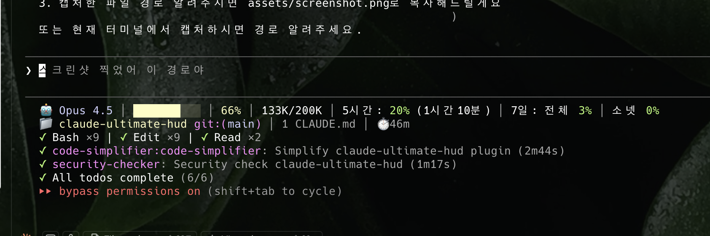

# claude-ultimate-hud

[English](README.md) | [한국어](README.ko.md)

Claude Code를 위한 궁극의 상태 표시줄 플러그인 - [claude-dashboard](https://github.com/uppinote20/claude-dashboard)와 [claude-hud](https://github.com/jarrodwatts/claude-hud)의 장점을 결합했습니다.



## 기능

### claude-dashboard에서 가져온 기능
- 🤖 **모델 표시**: 현재 모델 (Opus, Sonnet, Haiku)
- 📊 **프로그레스 바**: 컨텍스트 사용률 색상 표시 (초록 → 노랑 → 빨강)
- 📈 **토큰 수**: 현재/전체 토큰 (K/M 형식)
- 💰 **비용 추적**: 세션 비용 (USD)
- ⏱️ **Rate Limits**: 5시간/7일 제한 및 리셋 카운트다운

### claude-hud에서 가져온 기능
- 📁 **프로젝트 정보**: 디렉토리명 + Git 브랜치
- 📋 **설정 개수**: CLAUDE.md, rules, MCPs, hooks
- ⏱️ **세션 시간**: 작업 시간
- 🔧 **툴 활동**: 실행 중/완료된 툴 및 횟수
- 🤖 **에이전트 상태**: 서브에이전트 진행 상황
- ✅ **TODO 진행률**: 현재 작업 및 완료율

### 추가 기능
- 🌐 **다국어 지원**: 영어/한국어 자동 감지

## 출력 예시

```
🤖 Opus 4.5 │ ████░░░░░░ 18% │ 37K/200K │ $0.04 │ 5시간: 12% (3시간59분) │ 7일: 18% │ 7일-S: 1%
📁 my-project git:(main) │ 2 CLAUDE.md │ 8 rules │ 6 MCPs │ 6 hooks │ ⏱️ 1h30m
◐ Read: file.ts │ ✓ Bash ×5 │ ✓ Edit ×3
◐ explore: 패턴 찾는 중... │ ✓ librarian (2s)
▸ 인증 플로우 구현 (2/5)
```

## 설치

### 플러그인 마켓플레이스에서 설치

```
/plugin marketplace add hadamyeedady12-dev/claude-ultimate-hud
/plugin install claude-ultimate-hud
/claude-ultimate-hud:setup
```

### 수동 설치

```bash
git clone https://github.com/hadamyeedady12-dev/claude-ultimate-hud.git ~/.claude/plugins/claude-ultimate-hud
cd ~/.claude/plugins/claude-ultimate-hud
bun install && bun run build
```

그 다음 실행:
```
/claude-ultimate-hud:setup
```

## 설정

```
/claude-ultimate-hud:setup [언어] [플랜]
```

| 인자 | 옵션 | 기본값 |
|------|------|--------|
| 언어 | `auto`, `en`, `ko` | `auto` |
| 플랜 | `max`, `pro` | `max` |

예시:
```
/claude-ultimate-hud:setup ko max   # 한국어, Max 플랜
/claude-ultimate-hud:setup en pro   # 영어, Pro 플랜
```

## 요구사항

- **Claude Code** v1.0.80+
- **Bun** 또는 **Node.js** 18+

## 색상 범례

| 색상 | 사용률 | 의미 |
|------|--------|------|
| 🟢 초록 | 0-50% | 안전 |
| 🟡 노랑 | 51-80% | 주의 |
| 🔴 빨강 | 81-100% | 위험 |

## 플랜별 차이

| 기능 | Max | Pro |
|------|-----|-----|
| 5시간 rate limit | ✅ | ✅ |
| 리셋 카운트다운 | ✅ | ✅ |
| 7일 전체 모델 | ✅ | ❌ |
| 7일 Sonnet 전용 | ✅ | ❌ |

## 크레딧

이 플러그인은 다음 프로젝트의 기능을 결합했습니다:
- [claude-dashboard](https://github.com/uppinote20/claude-dashboard) by uppinote
- [claude-hud](https://github.com/jarrodwatts/claude-hud) by Jarrod Watts

## 라이선스

MIT
